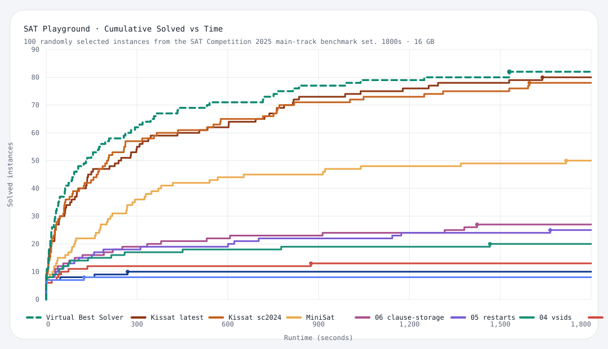

# SAT-playground

Fun with Boolean SAT.

[Live benchmark page](https://bjlkeng.io/SAT-playground/)



[Boolean SAT](https://en.wikipedia.org/wiki/Boolean_satisfiability_problem) asks whether there exists an assignment of true/false values that makes a Boolean formula evaluate to true. The goal of this repo is to understand SAT solvers more deeply by building them step by step in Rust, then benchmarking them on 100 randomly selected instances from the [SAT Competition 2025 main-track benchmark set](https://satcompetition.github.io/2025/downloads.html). All code in this repository was generated with AI coding tools and then iterated through benchmarking, debugging, and cleanup.

Each solver iteration lives in its own directory, building on lessons from the previous one.

## Project Structure

```
SAT-playground/
├── README.md
├── CLAUDE.md
├── benchmarks/             # SAT Competition 2025 benchmark instances (DIMACS CNF)
│   └── README.md           # Instructions for downloading benchmarks
├── tests/                  # Smoke test suite
│   └── cnf/
│       ├── sat/            # SAT instances (unit, two_clause, three_sat, all_positive)
│       └── unsat/          # UNSAT instances (contradiction, empty_clause, pigeonhole, chain)
├── tools/                  # Shared scripts
│   ├── smoke_test.sh       # Run smoke tests against a solver iteration
│   └── bench.sh            # Run a solver against the full benchmark suite
└── solver/                 # Current solver iterations
    ├── 01-naive-dpll/
    ├── 02-cdcl/
    ├── 03-bcp/
    ├── 04-vsids/
    ├── 05-restarts/
    ├── 06-clause-storage/
    └── 07-clause-minimization/
```

### Iteration Directory Layout

Each iteration is a standalone Rust project:

```
solver/NN-name/
├── Cargo.toml
├── src/
│   └── main.rs
├── build.sh          # SAT Competition build script (calls cargo build --release)
├── run.sh            # SAT Competition run script (invokes binary with CNF path + proof dir)
└── README.md         # What changed in this iteration, design notes, benchmark results
```

## SAT Competition 2025 Compliance

Every iteration conforms to the [SAT Competition 2025](https://satcompetition.github.io/2025/index.html) solver interface:

### Input — DIMACS CNF

```
c comment line
p cnf <num_vars> <num_clauses>
1 -3 0
2 3 -1 0
```

- Variables are positive integers `1..num_vars`
- Literals are non-zero integers; negative = negated
- Each clause is a space-separated list of literals terminated by `0`

### Output — stdout

```
s SATISFIABLE | UNSATISFIABLE | UNKNOWN
v 1 -2 3 ... 0          (only when SAT)
```

- **Solution line** (`s ...`): exactly one, mandatory
- **Value lines** (`v ...`): space-separated literals, terminated by `0`, max 4096 chars/line
- **Comment lines** (`c ...`): optional, anywhere

### UNSAT Proofs

When the solver determines UNSAT, it writes a DRAT proof to `<output_dir>/proof.out`. This can be verified with:
- `drat-trim` → LRAT → `cake_lpr`
- `gratgen` → `gratchk`
- `veripb` → `cake_pb_cnf`

### Scripts

**`build.sh`** — takes no arguments, builds the solver.

**`run.sh <cnf_path> <output_dir>`** — runs the solver on the given instance, writes proof to `<output_dir>/proof.out` if UNSAT.

### Competition Environment

- **CPU:** 8-core Intel Xeon E3-1230 v5 @ 3.40 GHz (Main Track)
- **Time limit:** 5000 seconds
- **Memory limit:** 30 GB RAM
- **Scoring:** PAR-2 (runtime for solved + 2× timeout for unsolved)

## Benchmarks

The 2025 Main Track benchmarks (~400 instances) are available from:

```
https://benchmark-database.de/?track=main_2025&context=cnf
```

Download with:
```bash
# Download the URI list, then fetch all instances
wget -O benchmarks/track_main_2025.uri "https://benchmark-database.de/?track=main_2025&context=cnf"
cd benchmarks && wget --content-disposition -i track_main_2025.uri
```

See `benchmarks/README.md` for full setup instructions.

## Quick Start

```bash
# Build iteration 01
cd solver/01-naive-dpll && bash build.sh

# Run on a single instance
bash run.sh ../../benchmarks/some_instance.cnf /tmp/proof_output

# Run smoke tests (9 small SAT + UNSAT instances)
bash tools/smoke_test.sh solver/01-naive-dpll

# Run the profiling benchmark suite
bash tools/bench.sh -t 120 -d benchmarks/profiling solver/01-naive-dpll
```

## Current Iterations

| #  | Name                         | Key Technique                                      | Current Focus |
|----|------------------------------|----------------------------------------------------|---------------|
| 01 | naive-dpll                   | Basic DPLL with unit propagation + DRAT proofs     | Correct baseline |
| 02 | cdcl                         | First CDCL solver with conflict learning           | Non-chronological backtracking |
| 03 | bcp                          | Two-watched-literal Boolean constraint propagation | Event-driven propagation |
| 04 | vsids                        | EVSIDS-style variable activity + indexed heap      | Better branching |
| 05 | restarts                     | Luby restarts + phase saving                       | Strong restart baseline |
| 06 | clause-storage               | MiniSat-style clause layout and blocker watchers   | Storage-only hot-path rewrite |
| 07 | clause-storage-minimization  | Clause storage plus runtime clause minimization    | Safe conflict-clause shrinking on top of `06` |

Each iteration directory has its own `README.md` with the actual implementation notes, validation
status, and benchmark history for that solver.

## References

- [SAT Competition 2025](https://satcompetition.github.io/2025/index.html)
- [DIMACS CNF Format](https://satcompetition.github.io/2025/benchmarks.html)
- [Handbook of Satisfiability](https://ebooks.iospress.nl/volume/handbook-of-satisfiability-second-edition) — Biere, Heule, van Maaren, Walsh
- [MiniSat](http://minisat.se/) — reference CDCL implementation
- [CaDiCaL](https://github.com/arminbiere/cadical) — state-of-the-art solver
- [Kissat](https://github.com/arminbiere/kissat) — competition winner lineage
